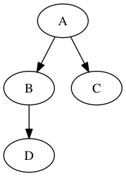

py3dot
======

py3dot is a Python 3 interface for Graphviz.


Usage
-----

Create a simple digraph and draw the graph.
```py
from py3dot import Graph

graph = Graph()
graph.add_edges_from([('A', 'B'), ('A', 'C'), ('B', 'D')])
graph.save_fig('my_graph.png')  # yields following fig.
```

